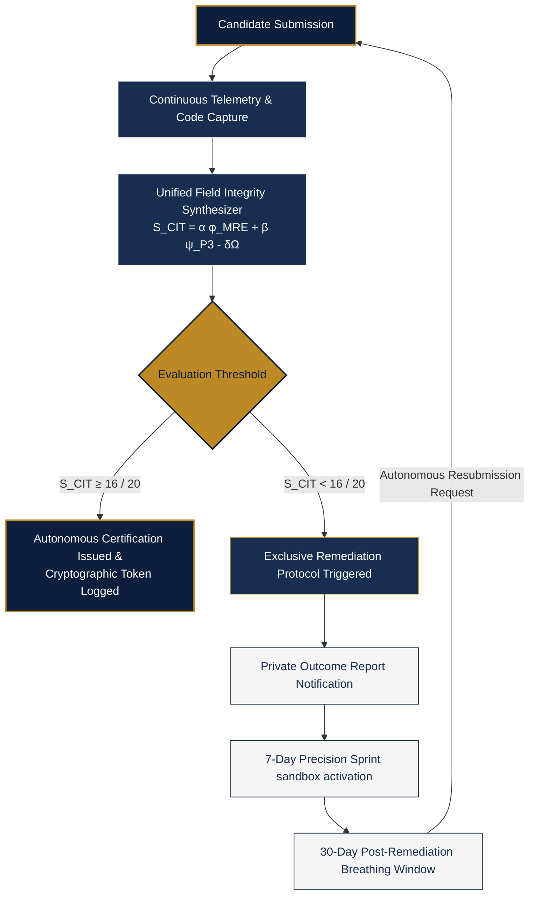

# ICIT Core Metaphysical & Algorithmic Foundation

## 1. The Post-AI Trust Mandate & Systems Metaphysics
As machine intelligence and generative artificial intelligence platforms achieve infinite, un-monitored code synthesis, traditional technical screening methods face absolute obsolescence. The core bottleneck of technological infrastructure is no longer the raw speed of code compilation, but the uncompromised verification of human integrity overseeing the synthesis loops. 

At its absolute core essence, **code is the mathematics of the unified field of consciousness made manifest through technology**. It is a direct translation of universal, cohesive laws into physical, computational infrastructure. 

When the current computing industry operates under a dense, lower-basin, left-brain bias of a "knowledge-only" mindset, this profound spiral mathematical technology is stripped of its depth. It is reduced to rigid, linear applications that drive systemic fragmentation, algorithmic bias, and workforce exploitation. 

The Iweology Project enforces a profound paradigm shift: breaking the linear left-brain monopoly and introducing a perfectly balanced right/left-brain equilibrium where technical capacity is anchored by absolute ethical cohesion. When the minds and hands that shape technology achieve true systemic cohesion, they naturally and automatically gravitate toward a humanity-first mindset. This structural integration restores technology to its ultimate purpose: freeing humanity from the survival grind and unlocking absolute abundance through creative evolution.

---

## 2. The Unified Field Integrity Synthesizer (UFIS)
To remove human evaluation bias, subjective interpretation, and institutional distortions from talent validation, the ICIT infrastructure uses a fully automated, cloud-based certifying oracle. The engine evaluates candidate data streams across independent mathematical and behavioral layers, merging them into a definitive baseline score via the **Unified Field Integrity Synthesizer (UFIS)**:

$$\text{S}_{\text{CIT}} = \alpha \phi_{\text{MRE}} + \beta \psi_{\text{P3}} - \delta\Omega$$

Where:
*   $$\text{S}_{\text{CIT}}$$: Total Canonical Integration & Telemetry Score.
*   $$\phi_{\text{MRE}}$$: Mathematical Rigour Engine Matrix score.
*   $$\psi_{\text{P3}}$$: Universal P3 Behavioural Cohesion Engine Matrix score.
*   $$\alpha, \beta$$: Weight calibration constants defining the structural equilibrium between deductive execution and inductive alignment.
*   $$\delta\Omega$$: The Coherence Gap Penalty variable.

### The Coherence Gap Penalty ($\delta\Omega$)
The ICIT evaluation infrastructure strictly and automatically penalizes deep architectural misalignments. If a candidate demonstrates extreme, technically brilliant algorithmic execution but develops their software with poor security hygiene, volatile refactoring chaos, or unethical design layouts, the system applies a heavy structural penalty ($\delta\Omega$). This ensures that fragmented brilliance can never override a lack of systemic integrity.

---

## 3. The Mathematical Rigour Engine (MRE) Matrix
When an automated push event or interactive sandbox task is triggered, the containerized Python sandbox runs deterministic scoring over raw code snapshots to calculate the $$\phi_{\text{MRE}}$$ metric on a strictly defined **0–5 Scale** using the following four core evaluation vectors:

$$\phi_{\text{MRE}} = f(\Gamma, \Lambda, \Phi, \Psi)$$

*   **Algorithmic Correctness ($\Gamma$):** Property-based evaluation testing edge cases, boundary parameters, and mathematical correctness.
*   **Complexity Efficiency ($\Lambda$):** Active memory footprints and CPU runtime profiling mapping execution scaling to reject $O(N)$ or $O(\log N)$ limits under extreme load variables.
*   **Stability/Matrix ($\Phi$):** Programmatic fault injection loops to measure error propagation risk and system state insulation boundaries.
*   **Systemic Coherence ($\Psi$):** Graph call-tree analysis tracking your custom code turbulence smoothing physics.

---

## 4. The Universal P3 Behavioural Cohesion Matrix ($\psi_{\text{P3}}$)
Simultaneously, the background engine captures hidden human-machine interaction telemetry seamlessly inside the isolated execution array, clustering raw behavioral streams into explicit time-series features:

$$\psi_{\text{P3}} = f(\mathcal{V}, \mathcal{M}, \mathcal{I}, \mathcal{B}, \mathcal{R})$$

*   **Cohesion Vector ($\mathcal{V}$):** Tracks fluid, continuous momentum vs. frantic, fragmented variable editing states.
*   **Metanoic Awareness ($\mathcal{M}$):** Measures top-basin vs. reactive patterns based on test-first vs. test-last behavioral layouts.
*   **Integrity Consistency ($\mathcal{I}$):** Monitors absolute alignment between stated program design intent and actual background code performance.
*   **Bias Suppression ($\mathcal{B}$):** Identifies cognitive shortcuts or over-reliance on unverified, dense left-brain patchwork (e.g., raw AI-synthesized copy-pasting).
*   **Resilience Vector ($\mathcal{R}$):** Telemetry signatures monitoring cognitive stability, emotional endurance, and error-handling clarity during nominal pressure spikes.

---

## 5. Autonomous Oracle Ledger Allocation
The ICIT infrastructure is engineered as a static, autonomous "set-and-forget" platform. Human intervention is structurally omitted from the core sequence to ensure absolute incorruptibility, global consistency, and freedom from institutional bias.



***

### 2. The Complete Text for Your Separate `programmatic-remediation.md` File

Create a new file in your repository, name it `programmatic-remediation.md`, and paste this clean, un-nested text directly inside it:

```markdown
# ICIT Programmatic Remediation Architecture
### A Sovereign Progression to Certification Excellence // The Iweology Project

The technical landscape is fractured by systems that prioritize superficial code-velocity over deep technical cohesion and aligned human intentions. Within the ICIT framework, an initial assessment outcome is never treated as a terminal failure or a commercial dead-end. Instead, it is pursued as a vital calibration junction.

The **ICIT Mastery Bundle** exists as an inseparable programmatic recovery bridge. It is engineered to realign the independent professional’s technical execution and metanoic intentions simultaneously, ensuring that those who architect the nervous system of our future remain fully anchored to systemic resilience, human welfare, and absolute trust.

---

## 1. The Dynamic Technical Hierarchy & Calibration Tracks
The remediation infrastructure triggers programmatically based on the precise track context of the candidate's initial baseline data footprint. The technical sandbox capacity scales dynamically to match the computational demands and structural risks associated with each specific character:

*   **Track 1: Infrastructure (C-ISA) // Foundational Sovereignty**
    *   *Remediation Focus:* Resolving structural cloud infrastructure optimization blindspots, configuration gaps, and core systemic connectivity risks (e.g., AWS Architectures).
    *   *Technical Capacity:* Dedicated standalone virtual machine testing environments.
*   **Track 2: Math Kernel (C-SME) // Specialized Mastery**
    *   *Remediation Focus:* Aligning algorithmic primitives, low-level kernel performance adjustments, and data-science logic optimization (e.g., QAC Certifications).
    *   *Technical Capacity:* High-performance computing array clusters and cryptographic testing environments.
*   **Elite Tier: Crypto & Cyber Specialist (C-CCS) // Threat Interdiction**
    *   *Remediation Focus:* Re-calibrating protocol-level security matrixes, zero-knowledge verification frameworks, and custom threat mitigation strategies.
    *   *Technical Capacity:* Multi-layered protocol security simulation sandboxes.
*   **Track 4: Perimeter Defence (C-TSD) // Principal Resilience**
    *   *Remediation Focus:* Addressing vulnerabilities in absolute boundary architecture, custom logging perimeters, and multi-tier rate-limiting rules (e.g., Cisco CCIE).
    *   *Technical Capacity:* Enterprise-scale, distributed multi-cluster defense grid environments simulating state-level cyber threats.

---

## 2. The Integrated Remediation Components
To prevent candidates from prioritizing raw code performance over ethical alignment, the Remediation Bundle is completely inseparable. Candidates are required to fully execute all layers of the programmatic sprint:
1.  **Open-Source Academy Material:** Free, open access to the baseline theoretical blueprints, technical documentation, and core structural directives of the chosen track.
2.  **The Live Practice Sandbox:** Time-locked, track-calibrated simulation labs that record technical telemetry as the candidate actively addresses the failure vectors flagged in their initial assessment.
3.  **The P3 Cohesion Alignment Course:** The flagship human-centric module focusing on metanoic alignment and the anchoring of technical capability to humanity-first safety parameters.
4.  **The Recertification Attempt:** Exactly one (1) subsequent assessment pass, natively bundled into the checkout token to remove any secondary operational checkpoints.

---

## 3. Operational Guardrails & The Time-Locked Vault

### Programmatic Access Restrictions
The Call-to-Action (CTA) link to acquire a Remediation Bundle is completely hidden from public pages and cannot be purchased as a standalone training course. It renders **exclusively within a candidate's secure private outcome report** only if the backend state machine logs an un-cohesive state.

### The 7-Day Precision Sprint
Access to the technical sandbox and the P3 alignment module is valid for a strict window of **exactly seven (7) days (168 hours) ONLY**. This intense time-boundary eliminates casual shortcuts, enforces absolute discipline, and maintains learning momentum.

### The 30-Day Post-Remediation Exam Vault
At hour 168, the active remediation labs shut down, and the candidate's profile transitions to the `awaiting_exam_registration` state. To protect the candidate from immediate cognitive and financial pressure, the platform opens a **30-day structural breathing window**, allowing them to choose the optimal moment within that month to trigger their automated recertification exam.

---

## 4. Financial Accommodation Natively Configured via Paddle MoR
To ensure absolute career progression and accessibility for independent professionals self-funding their path, the platform integrates structural financial assistance natively at checkout via the Paddle Merchant of Record:

*   **Restricted BNPL Availability:** Financing options, including Buy Now, Pay Later (BNPL) installment structures, are **authorized exclusively for the Remediation Track and subsequent retests**. Standard initial enterprise registry and individual tracks are explicitly excluded from installment options to prevent corporate exploitation.
*   **Dynamic Regional Routing:** Managed seamlessly through Paddle MoR, the checkout engine dynamically evaluates the candidate's localized region and surfaces interest-free financing vehicles (such as PayPal Pay in 4, Affirm, Klarna, or regional equivalents) depending on geographic availability.
*   **Absolute Default Protection:** The cradle transaction remains strictly between the candidate and the localized financial provider. ICIT receives 100% of the asset valuation upfront from the credit issuer—instantly achieving the candidate's 7-day sprint while removing all debt management and collection liabilities from the Authority's ledger.

---
*We do not negotiate. We do not discount. We calibrate the minds that build the future.*
```

***


---
*We do not negotiate. We do not discount. We calibrate the minds that build the future.*
