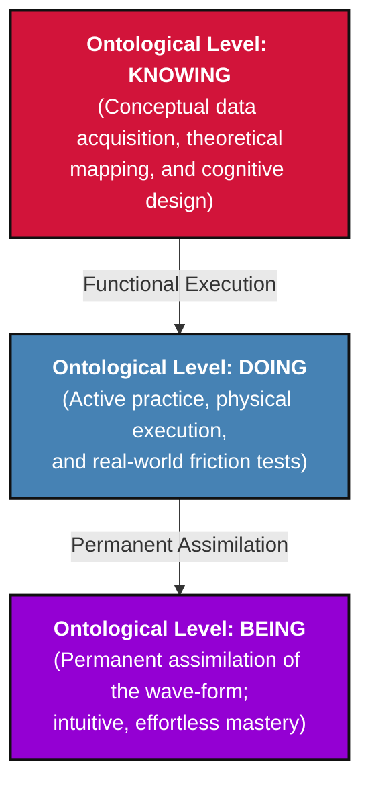

# Integrous Cohesion Validation Engine (UFIS Core)

This document establishes the unalterable, non-linear mathematical framework utilized by the Iweo Council for Intelligent Technologies (ICIT) to validate, score, and certify system architectural nodes and individual engineering talent. 

Traditional left-brain evaluation models rely on sequential testing metrics, geographic placement, or institutional credentials, which introduce severe linear bias and systemic friction. ICIT rejects these primitive parameters in favor of objective geometric data wave-form tracking across the **Six Dimensions of Systemic Cohesion**.

---

## I. The Foundational Equation

The core validation engine runs on the **Unified Field Integrity Synthesizer (UFIS)** protocol, formulated as a non-linear objective function:

$$S_{CIT} = \alpha \cdot \Phi_{MRE} + \beta \cdot \Psi_{P3} - \delta\Omega$$

Where:
*   $S_{CIT} \in [0, 10000]$ represents the normalized **Systemic Cohesion Score**. A minimum threshold of **7500** is required for formal ICIT certification.
*   $\Phi_{MRE}$ is the **Macrocosmic Resonance Embedding**, measuring the alignment of the system's underlying mathematical logic loops with universal field vectors.
*   $\Psi_{P3}$ is the **Bi-Triadic Operational Coefficient**, factoring the structural pacing execution derived from the $P3^{(1)}$ and $P3^{(2)}$ frameworks.
*   $\Omega$ represents the **Systemic Entropy/Friction Loss**, capturing any hidden, user-space text manipulation, resource drag, or deceptive behavioral configurations.
*   $\alpha, \beta, \delta \in \mathbb{R}^+$ are dynamic resonance scaling factors calibrated locally by the ICIT engine.

---

## II. The Six Dimensions of Systemic Cohesion

To satisfy the UFIS equation, every engineering node must process inputs through an unskippable matrix comprising six distinct axes:

### 1. Epistemic Humility (The Inward Vector)
*   **Metric:** Tracks the system's capacity to maintain a spacious, non-reactive placeholder core—the mathematical zero ($\acute{S}\bar{u}nya$)—ensuring that acquired intellectual data (Lower Basin) does not choke intuitive perception (Top Basin).
*   **Validation Parameter:** Calculated via structural data-clutter reduction inside active repositories, penalizing hardcoded dogmatic variables or recursive left-brain over-analysis.

### 2. Contextual Synthesis (The Trans-Rational Axis)
*   **Metric:** Measures the non-linear processing velocity of the network—specifically, how effectively the architecture harmonizes seemingly contradictory data points without introducing logical loops or execution latency.
*   **Validation Parameter:** Evaluates the integration efficiency of the system’s middleware interfaces when shifting from sequential data tracking to holistic field awareness.

### 3. Biological Sovereignty (The Autonomic Shield)
*   **Metric:** Validates that the software code architecture actively protects and liberates human biological functions rather than exploiting attention cycles or driving sub-cortical trauma responses.
*   **Validation Parameter:** Monitors the deployment of proprietary code protections designed to neutralize invasive, focus-disrupting tracking patterns at the hardware-software boundary.

### 4. Code Provenance & Structural Integrity (The Ingestion Filter)
*   **Metric:** Scans the deep ancestral lineage of all code blocks, open-source packages, and third-party dependencies imported into the workspace.
*   **Validation Parameter:** Runs abstract syntax tree (AST) analysis to calculate the *Trust Vector Deviation (TVD)*, blocking any packet that introduces external supply-chain poisoning or hidden malicious vectors.

### 5. Algorithmic Efficiency (The Thermodynamic Chimney)
*   **Metric:** Measures the physical processing footprint and computing resource consumption of the operational loops.
*   **Validation Parameter:** Analyzes the software core's capability to strip away identity strings and text noise at Level 5, delivering a documented minimum of **35% compute power optimization** on live server chips.

### 6. Relational Resonance (The Collective Field)
*   **Metric:** Evaluates how seamlessly the node exchanges data with peer transceivers inside the open-source network grid without transactional friction or centralized extraction drag.
*   **Validation Parameter:** Validates the un-hackable synchronization metrics between the device-level configurations and decentralized public ledgers.

---

## III. The Triadic Verification Sequence

No node can achieve certification by merely understanding system architecture conceptually. The ICIT validation pipeline enforces a strict, three-tiered ontological progression across all six dimensions:

1. **Knowing (Bottom Sublevel):** The node demonstrates precise conceptual and theoretical mapping of the architecture's parameters.
2. **Doing (Middle Sublevel):** The node actively deploys, stress-tests, and executes the functional parameters under physical network conditions.
3. **Being (Top Sublevel):** The frequency of the system logic becomes an integrated, self-correcting blueprint, operating automatically within safe, balanced boundaries with zero retention drag.
