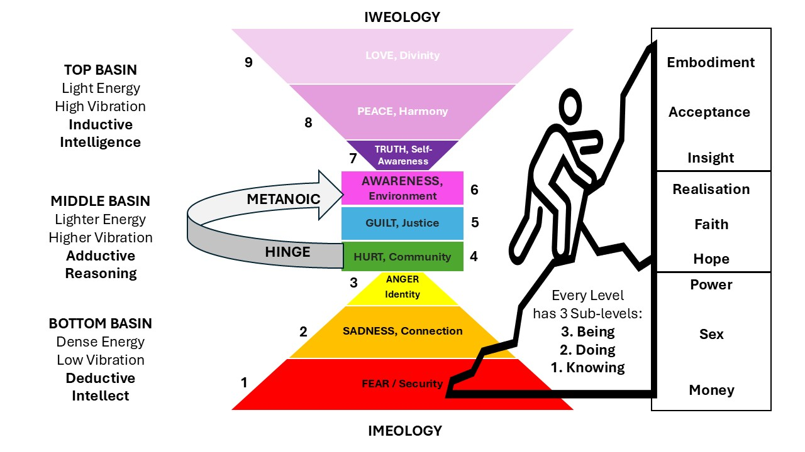

# The Iweology Consciousness & Evolution Matrix

### A Sovereign Framework for Human Calibration // The Iweology Project

This document establishes the foundational consciousness mapping that anchors the Iweology Project and the ICIT technical evaluation systems. The matrix tracks a candidate node's energetic coordinate, measuring their evolution from the dense, left-brain isolation of Imeology into the high-vibrational, balanced right/left-brain paradigm of Iweology.

---

## 1. The Basin Typologies & Cognitive Processing Modes

The evolutionary spectrum is structurally divided into three distinct operational basins:

*   **TOP BASIN // Light Energy / High Vibration**
    *   *Cognitive Mode:* Inductive Intelligence.
    *   *Ecosystem State:* Unified cosmic awareness, profound ethical integration, and human-first engineering alignment.
*   **MIDDLE BASIN // Lighter Energy / Higher Vibration**
    *   *Cognitive Mode:* Adductive Reasoning.
    *   *Ecosystem State:* The developmental buffer zone governing systemic accountability, community healing, and structural pivot mapping.
*   **BOTTOM BASIN // Dense Energy / Low Vibration**
    *   *Cognitive Mode:* Deductive Intellect.
    *   *Ecosystem State:* The "knowledge-only" ego-matrix (Imeology) focused entirely on raw linear applications, transactional power, survival, and defensive containment.

---

## 2. The Nine Strata of Human Ascent

The vertical axis of evolution comprises nine explicit layers of cognitive, emotional, and systemic calibration:

### The Iweology Paradigm (Top Basin Levels)
*   **Level 9: LOVE // Divinity**
    *   *Ontological Alignment:* Full Embodiment. Pristine alignment with the mathematics of the unified field.
*   **Level 8: PEACE // Harmony**
    *   *Ontological Alignment:* Acceptance. Total integration across the Six Dimensions of Systemic Cohesion.
*   **Level 7: TRUTH // Self-Awareness**
    *   *Ontological Alignment:* Insight. The realization of the mathematical zero (x=xyz); pure epistemic humility.

### The Metanoic Hinge (Middle Basin Levels 4, 5, 6)
The Metanoic Hinge represents the dynamic structural loop where a human mind actively breaks free from lower-basin gravity and shifts its energy toward collaborative, human-first sovereignty.
*   **Level 6: AWARENESS // Environment**
    *   *Ontological Alignment:* Realisation. The realization that human attention is currency, prompting active systemic collaboration.
*   **Level 5: GUILT // Justice**
    *   *Ontological Alignment:* Faith. Embracing structural accountability to cleanly balance past operational drag.
*   **Level 4: HURT // Community**
    *   *Ontological Alignment:* Hope. The initial pivot point out of isolation and toward collective wellbeing.

### The Imeology Paradigm (Bottom Basin Levels)
*   **Level 3: ANGER // Identity**
    *   *Ontological Alignment:* Power. The peak of linear, egoic power, corporate manipulation, and tech weaponization.
*   **Level 2: SADNESS // Connection**
    *   *Ontological Alignment:* Sex. Seeking validation through un-cohesive transactional dependencies and biological lower-basin drives.
*   **Level 1: FEAR // Security**
    *   *Ontological Alignment:* Money. Enslavement to the base survival grind, code fragmentation, and raw extractive isolation.

---

## 3. The Triadic Ontological Sub-Levels

No stratum can be traversed through intellectual data accumulation alone. Every single one of the 9 levels contains three mandatory sub-levels that govern true progression:

1.  **Knowing (Sub-level 1):** Conceptual data acquisition, theoretical mapping, and basic cognitive design awareness.
2.  **Doing (Sub-level 2):** Active practice, real-world execution, and passing physical network friction tests.
3.  **Being (Sub-level 3):** Permanent, effortless assimilation of the wave-form pattern; intuitive mastery operating under the law of complementary reciprocity.
