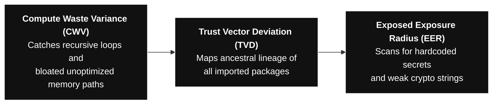

# ICIT Security Framework (Individual Engineer Specification)

This document defines the strict cryptographic and operational security standards required for individual engineers, standalone developers, and decentralized system architects operating under the ICIT governance protocol. 

Traditional enterprise security models focus entirely on protecting user-space application layers and centralized corporate networks, leaving the individual developer's local environment vulnerable to interception, extraction, and compliance overreach. ICIT enforces absolute **Individual Data Sovereignty** and zero-retention code hygiene at the local development gate.

---

## I. Individual Sovereignty & Workspace Insulation

An independent engineering node must maintain total insulation from external tracking matrices and centralized data-harvesting pipelines. Your local machine is a private coordinate antenna; it must remain anchored to a clean baseline.

### 1. Hardware-Level Cryptographic Hygiene
*   **The Silicon Secret:** All private deployment keys, code hashes, and digital signatures must be generated and stored exclusively inside a local hardware enclave (e.g., Trusted Execution Environment / TEE) or an isolated hardware security module (HSM). 
*   **Anti-Cloning Mandate:** Cryptographic identities used to sign code blocks or verify testnet deployments must be cryptographically bound to the physical machine's silicon footprint, ensuring that remote identity-theft, session-hijacking, or device-cloning attempts immediately freeze the keys locally.

### 2. Zero-Retention Network Boundary (Local Workspace)
*   **Volatile Isolation:** All local code compilation, vulnerability scanning, and testing workflows must run entirely within custom-allocated, zero-retention memory partitions (RAM). 
*   **The Anti-Leak Rule:** No unencrypted data context, diagnostic logs, or raw telemetry variables may be written to a persistent hard drive space. This architecture protects your localized workspace from automated background scraping or accidental persistent data leakage.

---

## II. Code Ancestry & Supply-Chain Defensive Controls

Individual coders are the primary gateway for software supply-chain poisoning. To protect your structural integrity, your local development pipeline must maintain an un-compromised ancestry vector.

### 1. The Tri-Stressor Local Gating Metrics
Before staging code or preparing an extraction patch for testing, the local development interface must calculate and evaluate three interlinked metrics:



*   **Compute Waste Variance (CWV):** Flags recursive background processes or memory-allocation leaks that cause high operational drag and drain server resources before deployment.
*   **Trust Vector Deviation (TVD):** Scans the deep history and contributor behavioral patterns of every open-source library or dependency you pull in from the internet. If package risk crosses the **75% parity threshold**, compilation is blocked natively.
*   **Exposed Exposure Radius (EER):** Scans active repositories to prevent engineers from accidentally hardcoding credentials, master API keys, or weak encryption structures.

---

## III. Verification Routing & Non-Custodial Clearing

When an individual coder interacts with automated networks or updates system repositories, value and validation clear without middleman friction.

```text
====================================================================
 LOCAL DEVELOPER SECURITY ACTIVE // GATEKEEPER MODE
====================================================================
[SCANNING] Verifying repository cryptographic signature...
──► Silicon Key Match:  VERIFIED  [Enclave Signature Lock]
──► Dependency Audit:  CLEAN     [TVD Score: 0.04]
──► Credential Check:  SECURE    [Zero Hardcoded Secrets]
====================================================================
[STATUS] PERIMETER BALANCED: Local environment achieve baseline.
👉 [ACTION] Launching secure, read-only CI/CD plugin verification.
====================================================================
```

*   **Cryptographic Stamping:** Every approved, high-vibrational code block is translated into an unalterable, encrypted file hash. This fingerprint is committed straight to a decentralized public ledger via automated scripts, legally locking in your un-splittable certificate of authorship.
*   **Non-Custodial Insulation:** Financial subscriptions, project assets, and tokenized utility balances belong directly to you as the creator. All clearings bypass traditional commercial banks or centralized tech platforms via non-custodial wallet routing, completely insulating your personal capital from regulatory overreach or sudden, horizontal system freezes.
