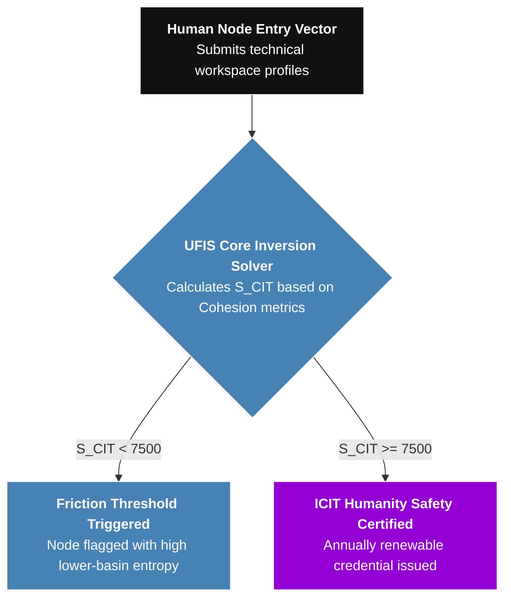

# ICIT Sovereign Operational Charter

This document serves as the constitutional charter and institutional proof of authority for the Iweo Council for Intelligent Technologies (ICIT). 

ICIT operates strictly as an independent, authoritative sovereign governance mechanism. It rejects reactive, lower-basin political compromises, old-world regulatory structures, and the administrative models of legacy non-profit organizations. ICIT asserts that governance must occur objectively through the mathematical verification of human and computational network nodes.

---

## I. The Principle of Human-First Cohesion

Humanity has entered the epoch of non-linear technology. Traditional administrative framework rules, standardized testing, and corporate HR committees are fundamentally unequipped to evaluate systemic alignment. Creative human capital cannot be judged by static, linear metrics.

ICIT establishes a decentralized, cryptographically secured sandbox designed to test and certify human talent across the **Six Dimensions of Systemic Cohesion**:

### 1. Mandatory Talent Verification Rules
To achieve an un-biasable certification standard, the ICIT validation loop completely neutralizes hiring bias born from gender, ethnicity, age, or localized geography. Every individual node is evaluated entirely on wave-form resonance:
*   **Proof-of-Coherence:** Talent profiles are run through the active Unified Field Integrity Synthesizer (UFIS) matrix to verify cognitive balance and context-sensitive qualitative discernment.
*   **Ontological Phasing:** Independent coders must progress their systems systematically through the unskippable triadic layers, demonstrating a clean baseline before keys are validated.

---

## II. Individual Coder Governance

The jurisdiction of this charter extends directly to individual engineers, standalone developers, and decentralized systems nodes registered inside the public ledger. 

Every individual node is bound by the **Harmonic Code of Conduct**:
*   **The Cohesion Mandate:** Engineers must submit their technical workspace profiles to automated testing variables running the Unified Field Integrity Synthesizer (UFIS) equation.
*   **The Provenance Rule:** Developers retain full, personal stewardship of their creative data assets and signed code footprints. They are legally and technically insulated from corporate platform monetization traps through non-custodial cryptographic verification.
*   **The Sovereign Stamping:** Code cannot be blindly thrown into shared public repositories. All distribution sequences must follow the explicit triadic path (Knowing → Doing → Being), mathematically proving the stability of the logic before the code is granted clearance tokens to merge.
